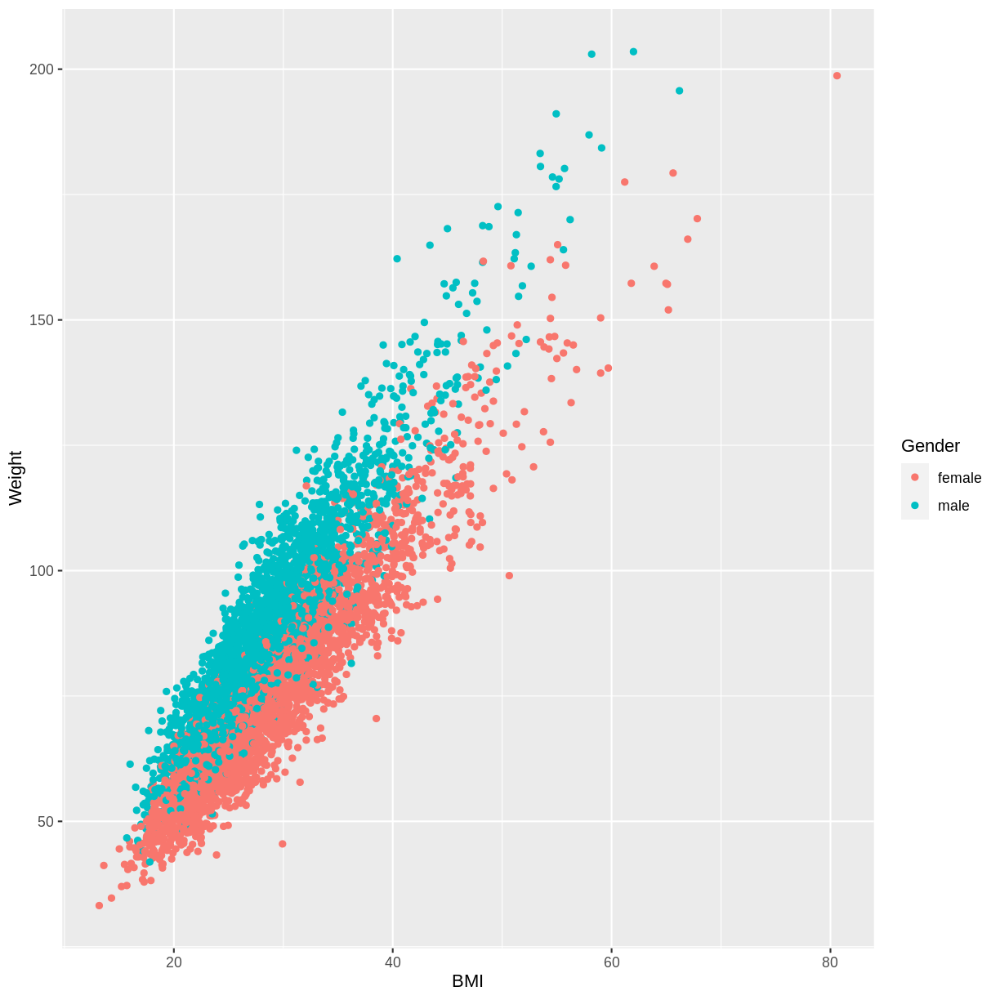

---
# Please do not edit this file directly; it is auto generated.
# Instead, please edit 01-contAndCat.md in _episodes_rmd/
source: Rmd
title: "Linear regression with one continuous and one categorical explanatory variable"
objectives:
  - Explore the relationship between a continuous dependent variable and two explanatory variables, one continuous and one categorical, using ggplot2. 
  - Fit a linear regression model with one continuous and one categorical explanatory variable using lm(). 
  - Use the jtools package to interpret the model output. 
  - Use the jtools and ggplot2 packages to visualise the model output.
keypoints:
questions:
teaching: 10
execises: 10
---

~~~
dat %>%
  filter(Age > 17) %>%
  ggplot(aes(x = BMI, y = Weight, colour = Gender)) +
  geom_point()
~~~
{: .language-r}

~~~
Warning: Removed 320 rows containing missing values (geom_point).
~~~
{: .warning}

